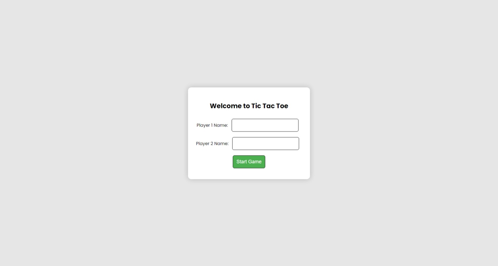
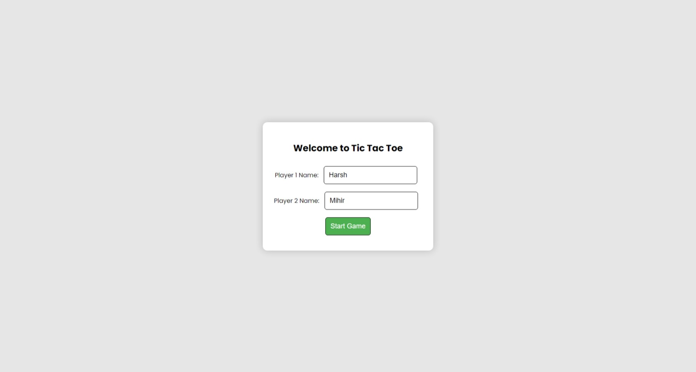
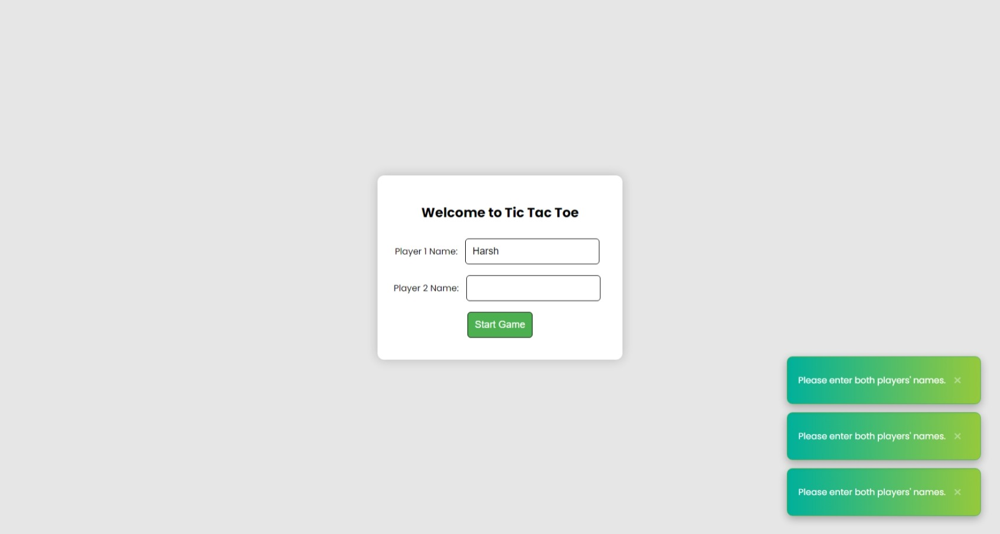
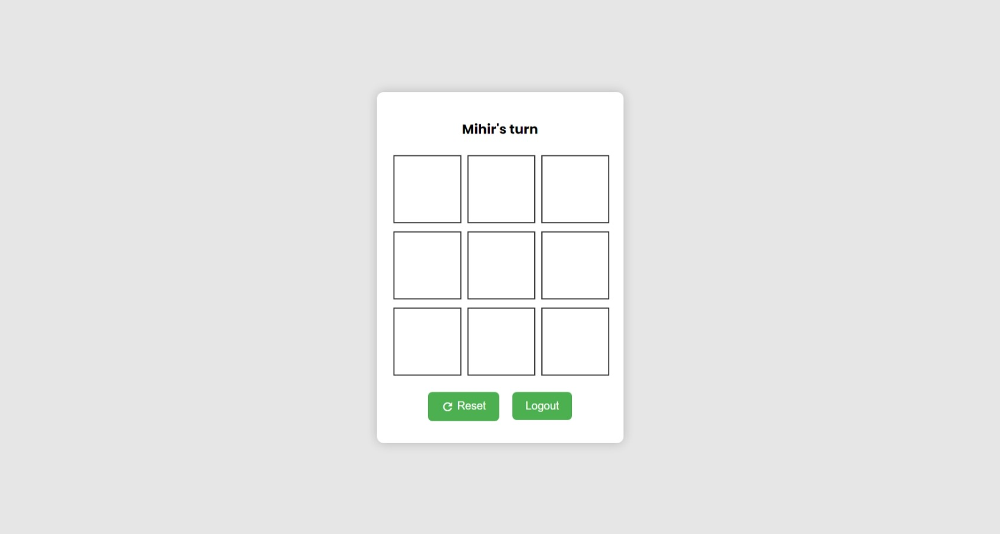
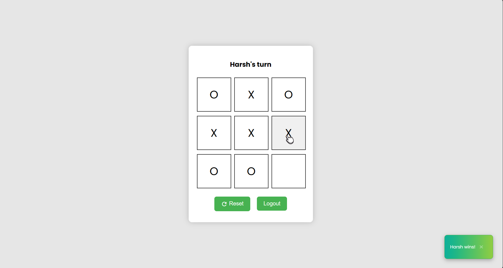

# Tic Tac Toe Game

Welcome to the Tic Tac Toe game! This simple web-based game allows two players to play the classic Tic Tac Toe game.

## Features

- Two-player game
- Responsive design
- Simple and intuitive interface

## How to Play

1. Open `index.html` in a web browser.
2. Enter the names of Player 1 and Player 2.
3. Click on "Start Game" to begin.
4. Players take turns to make a move by clicking on the cells.
5. The game announces the winner or a tie when the game ends.
6. You can reset the game or log out to start a new game.

## Technologies Used

- HTML
- CSS
- JavaScript

## Libraries

- [Toastify](https://github.com/apvarun/toastify-js) - Used for displaying toast messages.

## Usage

Clone the repository:

```bash
git clone https://github.com/harsh-pandhe/tic-tac-toe-game.git
cd tic-tac-toe-game
```

Open `index.html` in your preferred web browser.

## Screenshots

- Login Page


- Login Page with Random Credentials


- Login Page with Toast Messages


- Game Page


- Game Page Functionality 


- Game Page Win/Lose


